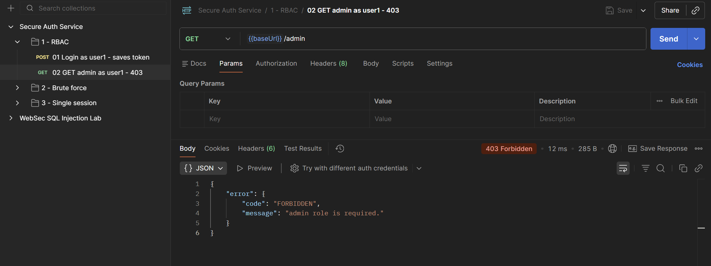
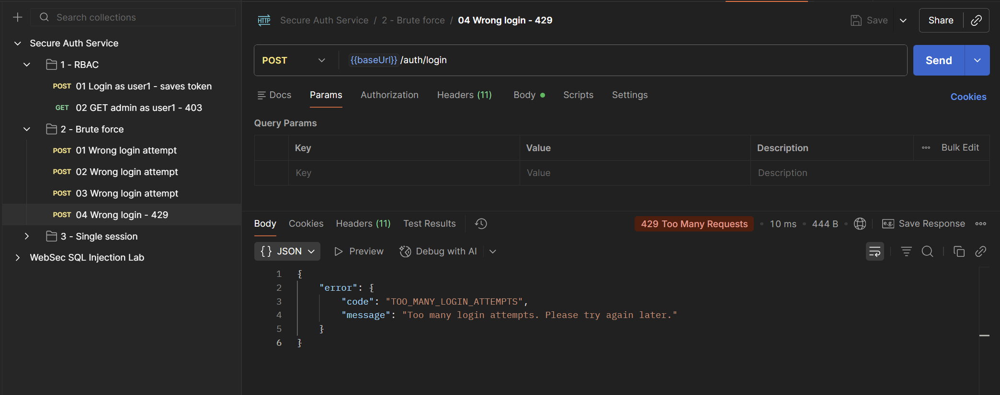
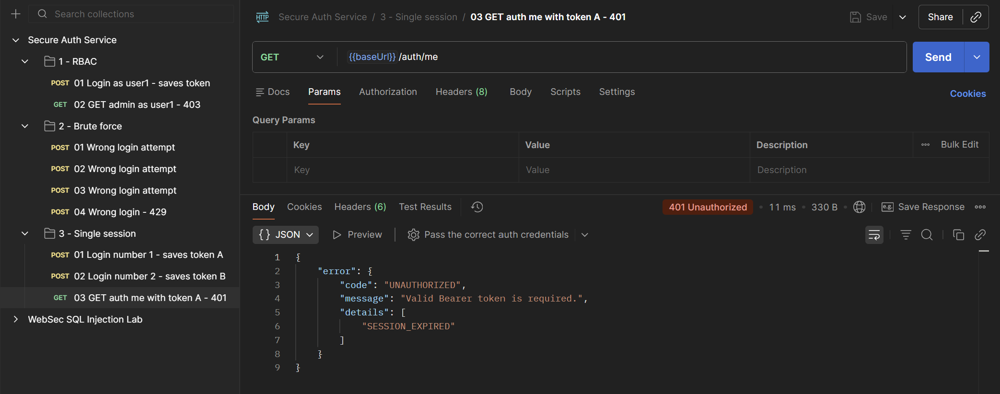

# Secure Auth Service

**Secure Auth Service** — учебный backend security lab на **Node.js + Express**, посвящённый безопасной аутентификации, управлению сессиями и role-based access control.

Проект показывает не только happy path авторизации, но и защиту от типичных ошибок: небезопасного хранения паролей, brute force, чрезмерных прав, утечки внутренних полей и повторного использования reset token.

> Это учебный security lab, а не production-ready identity provider.

## Что демонстрирует проект

- регистрация и login flow;
- bcrypt hash + salt для паролей;
- короткоживущие JWT access tokens;
- RBAC для `user`, `moderator`, `admin`;
- rate limiting для `/auth/login`;
- single-session protection: новый login инвалидирует предыдущую сессию;
- public DTO без `passwordHash` и внутренних session/reset fields;
- audit log успешных и неуспешных попыток входа;
- одноразовый password reset token, хранящийся в виде hash;
- единый JSON-формат ошибок;
- OpenAPI, Postman, automated tests и GitHub Actions CI.

## Стек

- Node.js
- Express
- JavaScript
- bcryptjs
- JSON Web Token
- express-rate-limit
- Node.js Test Runner
- OpenAPI
- Postman
- GitHub Actions

## Архитектура

```text
Client
  │
  ▼
Express routes
  │
  ├── auth middleware ──► JWT / RBAC checks
  │
  ├── auth service ─────► password/session/reset logic
  │
  └── public DTO ───────► filtered API response
```

Основные каталоги:

```text
secure-auth-service/
├── src/
│   ├── routes/
│   ├── middleware/
│   ├── services/
│   ├── data/
│   └── utils/
├── tests/
├── docs/
├── postman/
├── .github/workflows/ci.yml
├── .env.example
├── package.json
└── README.md
```

## Локальный запуск

Используйте Node.js 22 (минимум 18). Проверьте `node --version`.


```bash
git clone https://github.com/nikamurkaa/secure-auth-service.git
cd secure-auth-service
npm ci
cp .env.example .env
node --env-file=.env src/server.js
```

Команда выше рассчитана на Node.js 22 и явно загружает `.env`.
`npm start` использует только переменные процесса и встроенные значения;
сам по себе файл `.env` этот скрипт не читает.

По умолчанию API доступно на:

```text
http://localhost:3000
```

Пример `.env`:

```env
PORT=3000
JWT_SECRET=change-this-secret-in-real-projects
JWT_EXPIRES_IN=15m
LOGIN_RATE_LIMIT_WINDOW_MS=60000
LOGIN_RATE_LIMIT_MAX=3
PASSWORD_RESET_TOKEN_TTL_MS=600000
```

## Demo-аккаунты

Учётные данные ниже являются **локальными демонстрационными данными проекта**, а не реальными аккаунтами.

| Роль | Username | Password |
| --- | --- | --- |
| Admin | `admin` | `AdminPass123!` |
| Moderator | `moderator` | `ModeratorPass123!` |
| User | `user1` | `UserPass123!` |

## Основные endpoint'ы

| Метод | Endpoint | Назначение |
| --- | --- | --- |
| `GET` | `/health` | Health check |
| `POST` | `/auth/register` | Регистрация |
| `POST` | `/auth/login` | Вход |
| `GET` | `/auth/me` | Текущий пользователь |
| `POST` | `/auth/logout` | Инвалидация текущей сессии |
| `GET` | `/user` | Маршрут для авторизованных пользователей |
| `GET` | `/moderator` | Маршрут для moderator/admin |
| `GET` | `/admin` | Маршрут только для admin |
| `GET` | `/auth/login-attempts` | Audit log для admin |
| `POST` | `/auth/password-reset/request` | Создать reset token |
| `POST` | `/auth/password-reset/confirm` | Сменить пароль |

## Security controls

| Риск | Реализация |
| --- | --- |
| Утечка паролей | bcrypt hash + salt |
| Brute force | rate limiting на login |
| Excessive privileges | RBAC middleware |
| Старые активные сессии | `activeSessionId` инвалидирует предыдущий JWT |
| Утечка внутренних полей | public DTO / response filtering |
| Повторное использование reset token | одноразовый token + SHA-256 hash |
| Отсутствие аудита | журнал login attempts |

Подробнее: [`docs/security-model.md`](docs/security-model.md).

## Демонстрация security controls

### Role-Based Access Control

Обычный пользователь успешно аутентифицирован, но не имеет права обращаться к admin-only endpoint. RBAC middleware возвращает `403 Forbidden`.



### Login rate limiting

Повторные неуспешные попытки входа ограничиваются rate limiter. После достижения установленного лимита API возвращает `429 Too Many Requests`.



### Single-session protection

Повторный вход пользователя создаёт новую активную сессию и инвалидирует предыдущий JWT. Запрос со старым token отклоняется как истёкшая сессия.



## Проверка

```bash
npm test
npm run check
```

Тесты проверяют регистрацию, фильтрацию чувствительных данных, login/rate limiting, JWT/RBAC, session invalidation, expired tokens, audit log и password reset.

Ручные сценарии: [`docs/manual-checks.md`](docs/manual-checks.md).  
OpenAPI: [`docs/openapi.yaml`](docs/openapi.yaml).  
Postman: [`postman/`](postman/).

## CI

`.github/workflows/ci.yml` устанавливает зависимости, выполняет проверки и запускает automated tests. GitHub Actions workflow проекта запускался успешно.

## Статус

Проект завершён как учебный security lab по **authentication security, access control и API hardening**.

## Автор

[Николь Журбенко](https://github.com/nikamurkaa)

Команды выполняются из корня репозитория. Остановка сервера — `Ctrl+C`.
В PowerShell файл окружения можно скопировать командой
`Copy-Item .env.example .env`.
